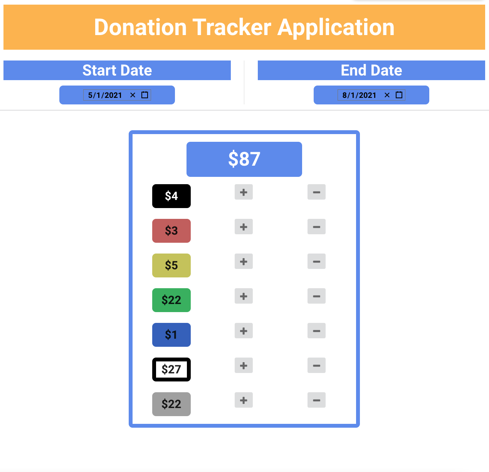

# Donate Counting Appication

## Description:
A web-based counter application in order to keep track of donation count tied to product sales.

## Screenshots:

## Technology Used:
#### Front-End:
- HTML
- CSS
- React.js
- Semantic UI React
#### Version Control:
- GitHub
#### Editor:
- VS Code Editor

## Stretch Goals:
- Node and PostgreSQL back-end.

## Other References:
// https://www.npmjs.com/package/react-date-picker
// https://codepen.io/trnkat96/pen/KqPOoX?editors=0010